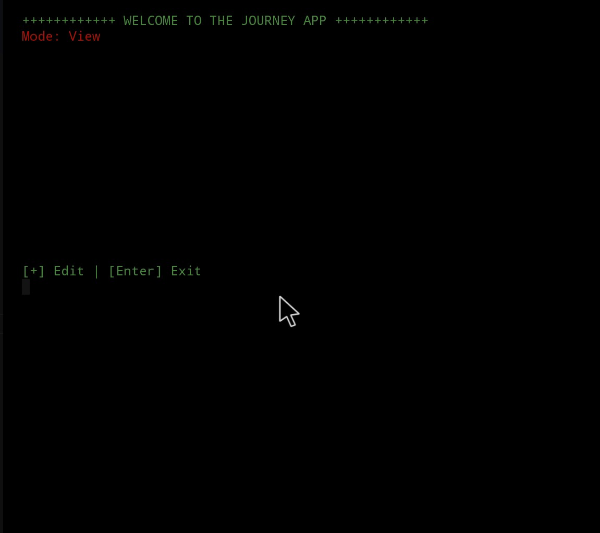

# journey-code

Journey or journal, is a personal app to practice my abilities with logic and files operations, basic aha, here it's focused more about the logic itself, to make it work, it will get improvements on the next project.
The project allows you to create one journal page by day and manipulate those pages whenever you feel necessary to.

Making a jouney app to practice external files

* l32/l39 - dayformarter() was implemented to solve problem to DDMMYY formart.
* l41/l74 - newJourney() <- dayformarter()
* 141/174 newJourney() algorithm for calculating missing days was solved finaly!
* Minor improvements in newJournay function.
* All bug has fixed with Texteditor.h, colors.h.

# TO-DO

+ Texteditor.h implemented to handle with journeys edition. see programadory/text-editor.git [DONE]
+ Create the path for pages and put all pages there, When a user intend to create a new page but it's the same day compare the currente data with the last item on vector. [DONE]
+ Create features like, Edit journal, Delete etc... [DONE]

# BUGS REPORTED

- it will be nedded set a limit to create newJourneys, limitating 1 by day! [FIXED]
- Memory leaks within stdout, it's caching the buffer. (colors.h scape bug probably); [FIXED]
- BUG segmentation fault with myLog struct, caused when calling to much pushs inside newJourney function. undefined stack<> size behaviour [FIXED]
- 

# EXTRAS!

+ LOG implemeted in Termux.h to help with debug
+ Small improvements for LOG in Termux.h and bug fixes.